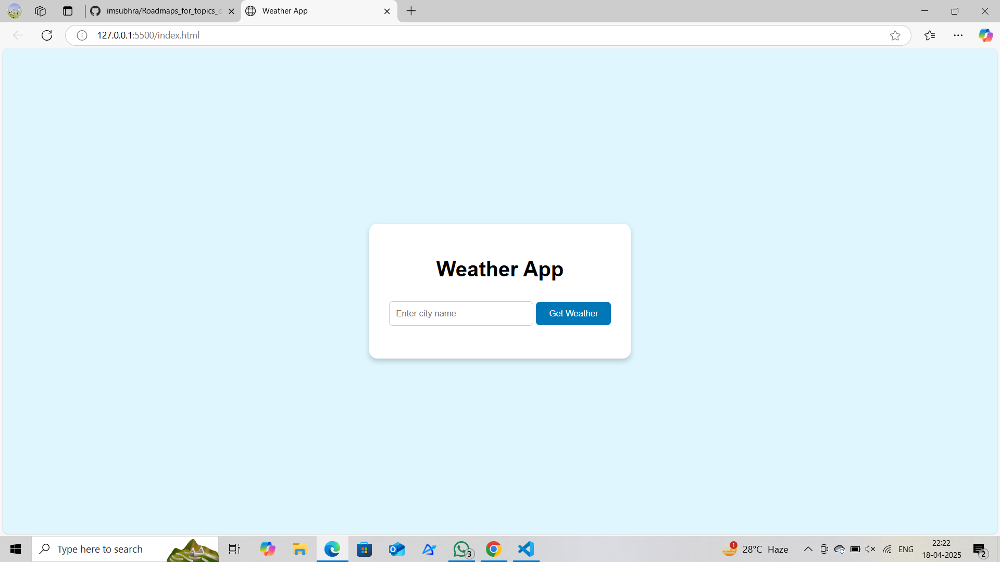
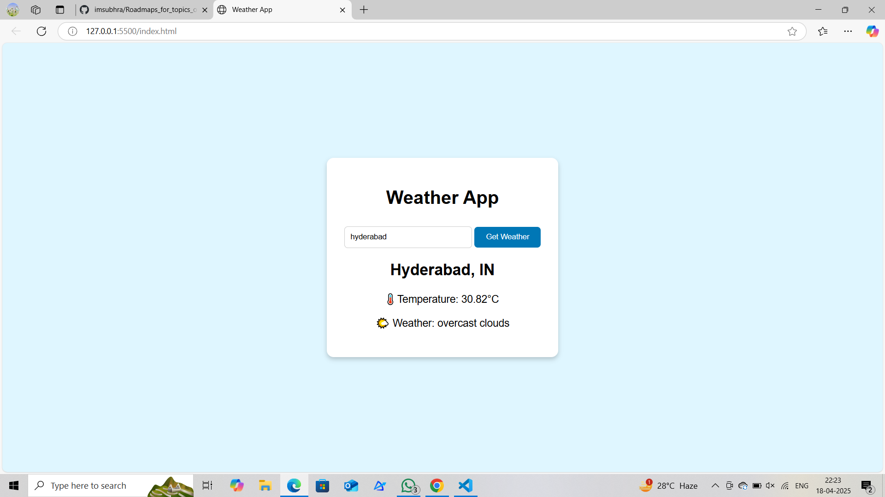
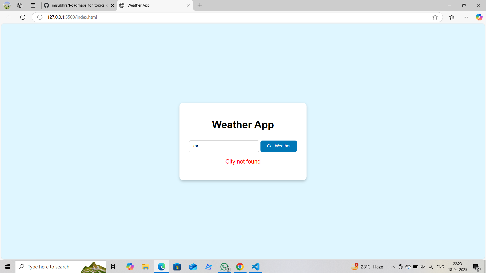

# weather-web-app
Weather app using Open Weather Map API
**Company**: CodTech
**Intern Name:** Deshetti Vinodini
**Intern ID:** CT08WN182
**Domain:** Mern Stack Web Development.  
**Duration:** 8 weeks Internship  
**Mentor:**  Neela Santhosh Kumar 
**TASK DESCRIPTION**
As part of my internship with CodTech IT Solutions, I undertook the task of developing a Weather Web Application. This application provides real-time weather data based on user input, using data fetched from the OpenWeatherMap API. The main goal of the project was to gain hands-on experience with APIs, frontend development, and integrating external data sources into a web interface. It was also intended to improve my understanding of user experience design, asynchronous JavaScript, and real-time application development principles.
The project began with the basic structure of the website, which was designed using HTML5 to create a semantic and accessible layout. This included a simple form input where users could enter the name of a city to fetch weather data. I focused on keeping the structure clean and intuitive to ensure the user experience was straightforward.
Once the HTML structure was ready, I moved on to designing the interface using CSS3. The design approach was kept minimalistic and responsive, so the application works well on both desktops and mobile devices. Media queries were used to adjust the layout based on screen sizes. I also used custom styling to enhance the visual appeal of elements like input fields, buttons, and weather data cards.
The core logic of the application was developed using JavaScript. This involved handling user input, performing input validation, sending requests to the OpenWeatherMap API, and then processing the JSON response to extract and display relevant weather information. I used the Fetch API to send HTTP requests and manage asynchronous operations with .then() chaining. The application retrieves various weather parameters such as temperature, humidity, weather conditions, wind speed, and an icon representing the current weather.
To make the application more interactive, I implemented error handling that displays a user-friendly message when an invalid city is entered or if the API fails to return data. This helped ensure that the application doesn’t crash and offers meaningful feedback to the user in all scenarios.
An important learning outcome of this project was working with APIs. By integrating the OpenWeatherMap API, I gained practical knowledge on how external data can be fetched and used within a web application. I learned how to register and obtain an API key, construct appropriate API URLs with query parameters, and handle different HTTP response statuses.
I also version-controlled the project using Git and hosted the source code on GitHub, following best practices like organizing the code into clear sections, adding meaningful commit messages, and maintaining a clean folder structure. The project repository includes a main HTML file, a CSS file for styling, a JavaScript file for logic, and an assets folder containing the relevant images or screenshots of the project.
Throughout the development of this Weather Web Application, I learned to manage both the visual and logical aspects of a frontend project. This task helped me strengthen my understanding of real-time web development, API integration, and how to create an interactive and user-friendly application. It gave me the confidence to build more complex web applications in the future and improved my coding skills, especially in JavaScript and frontend design.
By the end of the internship task, I had a fully functional Weather Web App that could instantly deliver live weather updates to users based on city names they enter, making it a practical and educational experience.
**Features**
**1.Real-Time Weather Data**
Instantly fetches and displays up-to-date weather information using the OpenWeatherMap API.

**2.City-Based Search**
Users can input any city name to get the current weather conditions specific to that location.

**3.Weather Details Displayed**
Includes temperature (in Celsius), humidity, weather condition (e.g., cloudy, sunny), wind speed, and weather icons for better visual understanding.

**4.Responsive Design**
Fully responsive layout that works smoothly on desktops, tablets, and mobile devices.

**5.Error Handling**
Displays user-friendly messages when the city name is not found or if there’s a problem fetching data from the API.

**6.Weather Icons Integration**
Dynamically shows weather icons based on the current condition (sun, rain, snow, clouds, etc.).

**7.Clean UI/UX**
Simple and clean user interface built with intuitive design, making it easy for users to navigate and interact with.

**8.Live API Integration**
Uses the Fetch API in JavaScript to retrieve and render live weather data without needing to reload the page.

**9.Fast Performance**
Lightweight and optimized for quick loading and response time.

**10.Fully Functional Without Login**
No user authentication or login required – the app is ready to use as soon as it loads.
 **Technologies Used**  
- **HTML5** – Markup language for structuring the web app  
- **CSS3** – Styling the user interface  
- **JavaScript** – Handling API calls and DOM updates  
- **OpenWeatherMap API** – For fetching real-time weather data  
- **Visual Studio Code** – Code editor used for development  
- **Git & GitHub** – Version control and code hosting platform

  **Deployment**

This project is hosted live and can be accessed anytime using the following link:

🔗 **Live Demo:** [Click Here to View Weather App](https://vinodinideshetti.github.io/weather-web-app/)
**Screenshots**

**Weather Home Screen**

**Weather Data Example**

**Error Display (Invalid City)**

